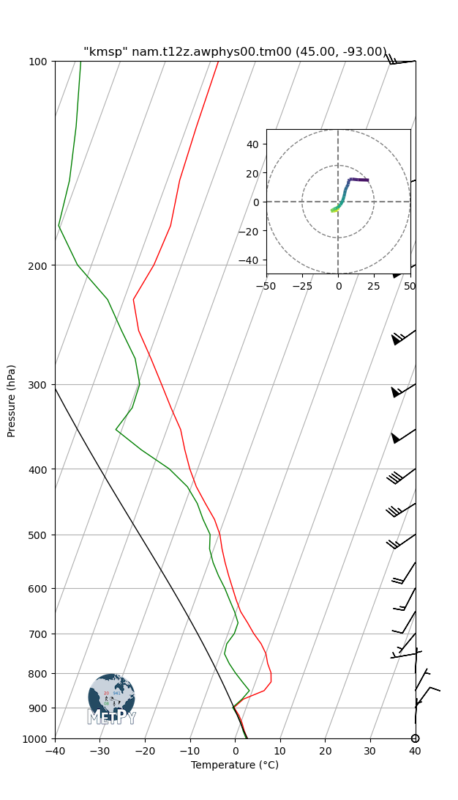

# oliepotpourri
A dumping ground for all my one-off Python scripts.

## archive.py
A very simple Python script to compress dashcam video for historical keeping.

I ran a dashcam every time I worked an Amazon Flex shift. Rather then overwriting old footage, I always downloaded the videos to my computer. I keep these files just in case a bogus legal claim emerges. I wrote the script to compress the files to save space on my storage. Now I can keep many months of video.

The script assumes you have [ffmpeg](https://www.ffmpeg.org/) in your path.

The output is 1 frame per second using the default compression quality.

## skew_t.py
Creates a Skew-T png file from a source GRIB file. A Skew-T diagram allows for a visual interpretation of weather balloon data. A GRIB file in this context is output from a NAM forecast model. The GRIB format contains a grid of lat/lon points with a rich set of weather data for each point. This script takes one point from the GRIB file, processes it, and creates the Skew-T image.

A Conda/Miniconda environment is used because the pygrib package won't build using pip/uv on Windows. To create the conda environent, navigate to the olie_skew-t folder and then:

    cd src/olie_skew-t
    conda env create -f environment.yml

To create a sample file, execute:

    python skew_t.py ../../sample_files/nam.t12z.awphys00.tm00.grib2 45.0 -93.0 kmsp

